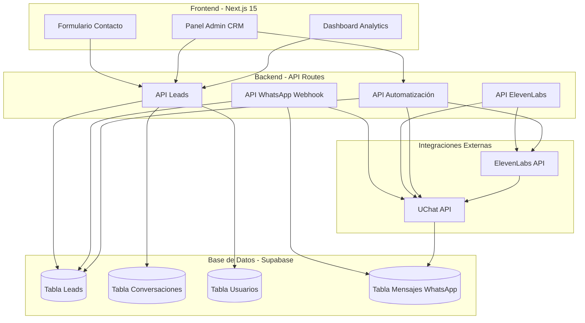
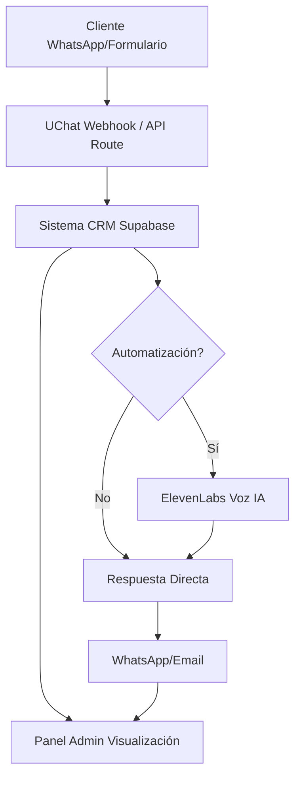
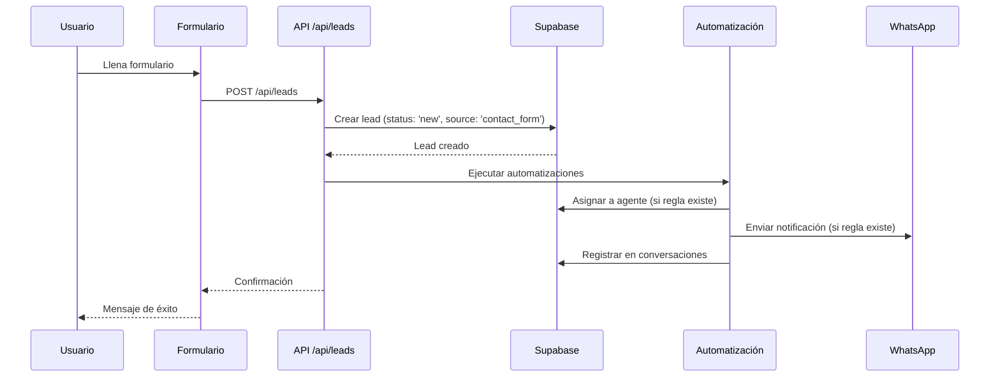
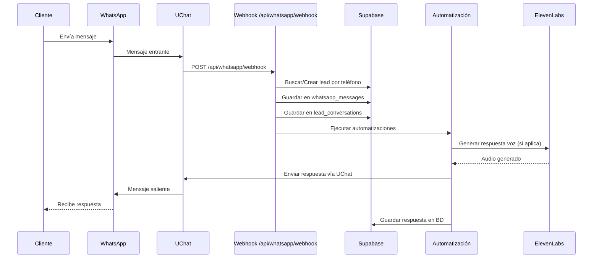
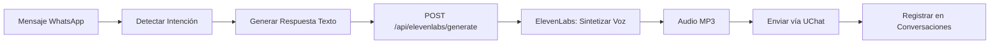

# Análisis Exhaustivo del Proyecto +COLOR y Plan de Implementación CRM + UChat + ElevenLabs

## 📋 Análisis del Proyecto Actual

### Tecnologías y Stack

**Frontend:**

- Next.js 15 con App Router
- React 18 + TypeScript
- Tailwind CSS + Framer Motion
- Radix UI / shadcn/ui para componentes
- TanStack Query (React Query) para gestión de estado del servidor

**Backend/Base de Datos:**

- Supabase (PostgreSQL) como base de datos principal
- Configurado en región sa-east-1 (Sudamérica)
- Tablas existentes: `products`, `categories`, `brands`, `product_features`, `assets`

**Arquitectura Actual:**

- Monorepo Next.js con estructura App Router
- Cliente de Supabase en `lib/supabase/client.ts`
- Servicios de productos en `lib/supabase/products.ts`
- No hay API routes implementadas actualmente
- Sistema de contacto básico (simulado, no guarda datos)
- Componentes de WhatsApp básicos (solo enlaces externos)

### Estado Actual del Sistema de Contacto

El sistema de contacto actual (`components/sections/contact.tsx`) tiene limitaciones:

- ✅ Formulario con campos: nombre, email, mensaje
- ❌ No guarda leads en base de datos
- ❌ Solo simula el envío (setTimeout)
- ❌ No integra con WhatsApp API
- ❌ No tiene seguimiento de leads

**Componentes WhatsApp existentes:**

- `components/whatsapp.tsx` - Botón simple con enlace externo
- `components/ui/whatsapp-button.tsx` - Botón de UI
- Solo abren WhatsApp Web, no integración API

### Estructura de Base de Datos Actual

**Tablas existentes:**

- `categories` - Categorías de productos
- `brands` - Marcas de productos
- `products` - Productos del catálogo
- `product_features` - Características de productos
- `assets` - Gestión de activos/imágenes

**Variables de entorno configuradas:**

- `NEXT_PUBLIC_SUPABASE_URL`
- `NEXT_PUBLIC_SUPABASE_ANON_KEY`
- `SUPABASE_SERVICE_KEY`
- `NEXT_PUBLIC_WHATSAPP_NUMBER`

## 🎯 Objetivos de la Implementación

### Funcionalidades CRM Requeridas

1. **Gestión de Leads**

   - Almacenamiento de leads en base de datos
   - Captura desde formulario de contacto
   - Captura desde WhatsApp (UChat)
   - Historial completo de interacciones

2. **Asignación de Leads**

   - Asignación manual/automática a agentes
   - Gestión de usuarios/agentes
   - Balanceo de carga

3. **Pipeline de Ventas**

   - Estados: nuevo, contacto, calificado, propuesta, ganado, perdido
   - Transiciones de estado
   - Filtros y búsqueda

4. **Notas e Historial**

   - Notas de conversaciones
   - Historial de mensajes WhatsApp
   - Timeline de eventos

5. **Analytics y Reportes**

   - Dashboard con métricas
   - Conversiones por fuente
   - Tiempo promedio de respuesta
   - Tasa de cierre

6. **Panel Administrativo**

   - Gestión de leads
   - Gestión de usuarios/agentes
   - Configuración de automatizaciones
   - Reportes y analytics

### Integraciones Requeridas

#### UChat - WhatsApp Business API

UChat es una plataforma de automatización de chat que proporciona acceso a WhatsApp Business API, permitiendo comunicación bidireccional y automatización de conversaciones.

**Capacidades Principales:**

1. **WhatsApp Business API**

   - Acceso oficial a WhatsApp Business API
   - Envío y recepción de mensajes de texto
   - Soporte para multimedia (imágenes, videos, documentos, audio)
   - Gestión de plantillas de mensajes (mensajes aprobados por WhatsApp)
   - Envío de mensajes masivos con plantillas

2. **Webhooks y Eventos**

   - Webhooks para mensajes entrantes
   - Notificaciones de estado de mensajes (enviado, entregado, leído, fallido)
   - Eventos de conversación (inicio, fin, transferencia)
   - Confirmaciones de entrega y lectura

3. **Gestión de Conversaciones**

   - Ventana de 24 horas para respuestas gratuitas
   - Manejo de conversaciones fuera de ventana (requiere plantillas)
   - Etiquetas y categorización de conversaciones
   - Gestión de contactos y perfiles

4. **Automatización**

   - Respuestas automáticas configurables
   - Flujos conversacionales (chatbots)
   - Reglas de enrutamiento de mensajes
   - Integración con sistemas externos vía API

**API de UChat - Endpoints Principales:**

- `POST /messages` - Enviar mensajes (texto, multimedia, plantillas)
- `GET /messages` - Obtener mensajes
- `POST /webhooks` - Configurar webhooks
- `GET /contacts` - Obtener información de contactos
- `GET /status` - Verificar estado de la conexión

**Implementación en el CRM:**

- **Recepción de Leads**: Capturar mensajes entrantes vía webhook y crear/actualizar leads automáticamente
- **Seguimiento Automatizado**: Enviar mensajes de seguimiento según el estado del lead en el pipeline
- **Notificaciones**: Alertar a agentes cuando un lead responde o cambia de estado
- **Historial Completo**: Guardar todos los mensajes intercambiados para mantener contexto completo
- **Respuestas Rápidas**: Responder automáticamente a preguntas frecuentes mientras se asigna a un agente

**Límites y Consideraciones:**

- Límites de rate de WhatsApp (1000 mensajes/conversación/24h en ventana)
- Mensajes fuera de ventana requieren plantillas aprobadas
- Validación de webhooks para seguridad
- Manejo de errores y reintentos para mensajes fallidos

#### ElevenLabs - API de Síntesis de Voz y Agentes Conversacionales

ElevenLabs ofrece tecnología avanzada de inteligencia artificial para generar voces naturales y realistas a partir de texto, ideal para chatbots con voz y agentes conversacionales.

**Capacidades Principales:**

1. **Text-to-Speech (TTS) - API de Síntesis de Voz**

   - Generación de audio a partir de texto en múltiples idiomas (más de 70 idiomas)
   - Voces pre-configuradas y personalizables
   - Control de entonación, velocidad y emociones
   - Formato de salida: MP3, PCM, Opus
   - Latencia baja para respuestas rápidas

2. **Voice Cloning y Personalización**

   - Clonar voces existentes (con permisos)
   - Crear voces personalizadas
   - Ajuste fino de características vocales
   - Múltiples voces para diferentes casos de uso

3. **Conversational AI (Agentes de Voz)**

   - Agentes conversacionales con memoria y contexto
   - Integración con APIs externas para datos en tiempo real
   - Gestión de conversaciones multi-turno
   - Síntesis de voz en tiempo real para respuestas naturales

4. **Audio Optimization**

   - Optimización automática de calidad de audio
   - Reducción de ruido
   - Ajuste de formato para diferentes plataformas
   - Streaming de audio para aplicaciones en tiempo real

**API de ElevenLabs - Endpoints Principales:**

- `POST /v1/text-to-speech/{voice_id}` - Generar audio desde texto
- `GET /v1/voices` - Listar voces disponibles
- `POST /v1/voices/add` - Crear voz personalizada
- `POST /v1/conversational-ai` - Generar respuestas conversacionales con voz
- `GET /v1/history` - Obtener historial de generaciones

**Implementación en el CRM:**

- **Respuestas de Voz en WhatsApp**: Convertir respuestas de texto a audio y enviarlas como mensajes de voz
- **Chatbot con Voz**: Crear un asistente virtual que responda con voz natural a consultas frecuentes
- **Personalización**: Usar diferentes voces según el tipo de mensaje o segmento de cliente
- **Notificaciones de Voz**: Enviar recordatorios o notificaciones importantes como mensajes de voz
- **Multilingüe**: Atender clientes en diferentes idiomas con voces nativas

**Casos de Uso en el Flujo CRM:**

1. **Lead Inicial**: Generar mensaje de bienvenida con voz personalizada cuando llega un nuevo lead
2. **Seguimiento**: Enviar recordatorios de seguimiento como mensajes de voz para mayor engagement
3. **Información de Productos**: Responder consultas sobre productos con explicaciones en audio
4. **Soporte**: Proporcionar respuestas automatizadas en voz para consultas comunes
5. **Cierre de Venta**: Mensajes de voz para seguimiento de propuestas y cierre de ventas

**Límites y Consideraciones:**

- Modelo de precios por caracteres generados (plan gratuito limitado)
- Latencia de generación (generalmente 1-3 segundos)
- Tamaño de mensajes limitado por WhatsApp (16MB para audio)
- Costos a considerar para alto volumen de mensajes
- Cache de respuestas frecuentes para optimizar costos
- Fallback a texto si la generación de voz falla

## 🏗️ Arquitectura Propuesta

### Diagrama de Arquitectura del Sistema



### Nuevas Tablas en Supabase

**1. `leads` - Tabla principal de leads**

```sql
CREATE TABLE leads (
  id UUID PRIMARY KEY DEFAULT uuid_generate_v4(),
  name TEXT NOT NULL,
  email TEXT,
  phone TEXT,
  source TEXT, -- 'contact_form', 'whatsapp', 'website'
  status TEXT DEFAULT 'new', -- 'new', 'contacted', 'qualified', 'proposal', 'won', 'lost'
  assigned_to UUID REFERENCES users(id),
  metadata JSONB, -- Datos adicionales flexibles
  created_at TIMESTAMP WITH TIME ZONE DEFAULT NOW(),
  updated_at TIMESTAMP WITH TIME ZONE DEFAULT NOW()
);
```

**2. `lead_conversations` - Conversaciones/Notas**

```sql
CREATE TABLE lead_conversations (
  id UUID PRIMARY KEY DEFAULT uuid_generate_v4(),
  lead_id UUID REFERENCES leads(id) ON DELETE CASCADE,
  user_id UUID REFERENCES users(id),
  channel TEXT, -- 'whatsapp', 'email', 'phone', 'internal'
  message TEXT NOT NULL,
  direction TEXT, -- 'inbound', 'outbound'
  metadata JSONB,
  created_at TIMESTAMP WITH TIME ZONE DEFAULT NOW()
);
```

**3. `users` - Usuarios/Agentes**

```sql
CREATE TABLE users (
  id UUID PRIMARY KEY DEFAULT uuid_generate_v4(),
  email TEXT UNIQUE NOT NULL,
  name TEXT NOT NULL,
  role TEXT DEFAULT 'agent', -- 'admin', 'agent', 'manager'
  is_active BOOLEAN DEFAULT true,
  created_at TIMESTAMP WITH TIME ZONE DEFAULT NOW(),
  updated_at TIMESTAMP WITH TIME ZONE DEFAULT NOW()
);
```

**4. `automation_rules` - Reglas de automatización**

```sql
CREATE TABLE automation_rules (
  id UUID PRIMARY KEY DEFAULT uuid_generate_v4(),
  name TEXT NOT NULL,
  trigger_type TEXT NOT NULL, -- 'new_lead', 'status_change', 'time_based'
  conditions JSONB,
  actions JSONB,
  is_active BOOLEAN DEFAULT true,
  created_at TIMESTAMP WITH TIME ZONE DEFAULT NOW()
);
```

**5. `whatsapp_messages` - Mensajes de WhatsApp**

```sql
CREATE TABLE whatsapp_messages (
  id UUID PRIMARY KEY DEFAULT uuid_generate_v4(),
  lead_id UUID REFERENCES leads(id),
  uchat_message_id TEXT,
  direction TEXT NOT NULL,
  phone_number TEXT NOT NULL,
  message TEXT NOT NULL,
  media_url TEXT,
  status TEXT, -- 'sent', 'delivered', 'read', 'failed'
  metadata JSONB,
  created_at TIMESTAMP WITH TIME ZONE DEFAULT NOW()
);
```

### Estructura de Directorios Propuesta

```
app/
├── api/                          # API Routes (NUEVO)
│   ├── leads/
│   │   ├── route.ts             # CRUD de leads
│   │   └── [id]/route.ts        # Operaciones específicas
│   ├── conversations/
│   │   └── route.ts             # Gestión de conversaciones
│   ├── whatsapp/
│   │   ├── webhook/route.ts     # Webhook de UChat
│   │   └── send/route.ts        # Enviar mensajes
│   ├── elevenlabs/
│   │   └── generate/route.ts    # Generar respuestas de voz
│   └── automation/
│       └── route.ts             # Gestión de automatizaciones
├── admin/                        # Panel administrativo (NUEVO)
│   ├── layout.tsx
│   ├── page.tsx                 # Dashboard
│   ├── leads/
│   │   ├── page.tsx             # Lista de leads
│   │   └── [id]/page.tsx        # Detalle de lead
│   ├── users/
│   │   └── page.tsx             # Gestión de usuarios
│   └── settings/
│       └── page.tsx             # Configuración
└── contacto/
    └── page-client.tsx          # MODIFICAR: Guardar leads

lib/
├── crm/                          # Servicios CRM (NUEVO)
│   ├── leads.ts                 # Servicio de leads
│   ├── conversations.ts         # Servicio de conversaciones
│   ├── users.ts                 # Servicio de usuarios
│   └── analytics.ts             # Analytics y reportes
├── integrations/                 # Integraciones externas (NUEVO)
│   ├── uchat.ts                 # Cliente UChat API
│   ├── elevenlabs.ts            # Cliente ElevenLabs API
│   └── whatsapp-handler.ts      # Manejo de mensajes WhatsApp
├── automation/                   # Sistema de automatización (NUEVO)
│   ├── engine.ts                # Motor de automatización
│   ├── rules.ts                 # Gestión de reglas
│   └── handlers.ts              # Handlers de acciones
└── supabase/
    └── crm.ts                    # Funciones CRM para Supabase (NUEVO)

components/
├── crm/                          # Componentes CRM (NUEVO)
│   ├── LeadCard.tsx
│   ├── LeadDetail.tsx
│   ├── ConversationThread.tsx
│   ├── LeadStatusBadge.tsx
│   └── LeadFilters.tsx
├── admin/                        # Componentes admin (NUEVO)
│   ├── Dashboard.tsx
│   ├── LeadsTable.tsx
│   ├── AnalyticsChart.tsx
│   └── UserManagement.tsx
└── sections/
    └── contact.tsx               # MODIFICAR: Integrar con CRM

hooks/
├── useLeads.ts                   # Hook para leads (NUEVO)
├── useConversations.ts           # Hook para conversaciones (NUEVO)
└── useCRM.ts                     # Hook general CRM (NUEVO)

types/
└── crm.ts                        # Tipos TypeScript para CRM (NUEVO)
```

### Flujo de Datos Propuesto



## 📝 Plan de Implementación

### Fase 1: Base de Datos y Estructura CRM (Fundación)

**Tareas:**

- [ ] Crear migraciones SQL para nuevas tablas en Supabase
  - [ ] `leads`
  - [ ] `lead_conversations`
  - [ ] `users`
  - [ ] `automation_rules`
  - [ ] `whatsapp_messages`
- [ ] Configurar Row Level Security (RLS) en Supabase
  - [ ] Políticas de acceso para usuarios
  - [ ] Permisos por rol (admin, agent)
- [ ] Crear tipos TypeScript en `types/crm.ts`
  - [ ] Interfaces para Lead, Conversation, User, etc.
- [ ] Implementar servicios base en `lib/crm/`
  - [ ] `leads.ts` - CRUD básico
  - [ ] `conversations.ts` - Gestión de conversaciones
  - [ ] `users.ts` - Gestión de usuarios
- [ ] Crear funciones Supabase en `lib/supabase/crm.ts`
  - [ ] Helpers para consultas complejas
  - [ ] Funciones de búsqueda y filtrado

**Archivos a crear:**

- `types/crm.ts`
- `lib/supabase/crm.ts`
- `lib/crm/leads.ts`
- `lib/crm/conversations.ts`
- `lib/crm/users.ts`
- `scripts/migrations/create-crm-tables.sql`

### Fase 2: Integración con UChat (WhatsApp API) - Semana 2, Días 8-10

**Objetivo:** Conectar el CRM con WhatsApp Business API a través de UChat para recibir y enviar mensajes automáticamente.

**Tareas Detalladas:**

1. **Crear cliente UChat en `lib/integrations/uchat.ts`**

   - Configurar autenticación con API Key de UChat
   - Implementar función `sendMessage()` para enviar mensajes de texto
   - Implementar función `sendMedia()` para enviar imágenes/audio/videos
   - Implementar función `sendTemplate()` para mensajes fuera de ventana
   - Implementar función `getMessageStatus()` para verificar estado de envío
   - Manejo de errores y reintentos automáticos
   - Validación de formato de números de teléfono

2. **Implementar API Route para webhook: `app/api/whatsapp/webhook/route.ts`**

   - Endpoint POST para recibir eventos de UChat
   - Validar firma del webhook para seguridad
   - Procesar mensajes entrantes (texto, multimedia)
   - Extraer número de teléfono y contenido del mensaje
   - Buscar lead existente por teléfono o crear nuevo lead
   - Guardar mensaje en tabla `whatsapp_messages`
   - Guardar conversación en tabla `lead_conversations`
   - Ejecutar automatizaciones si corresponde
   - Respuesta rápida al webhook (procesar asíncronamente)

3. **Implementar API Route para envío: `app/api/whatsapp/send/route.ts`**

   - Endpoint POST para enviar mensajes desde el panel admin
   - Validar autenticación del usuario
   - Validar datos del mensaje (destinatario, contenido)
   - Enviar mensaje vía UChat API
   - Registrar mensaje enviado en base de datos
   - Actualizar estado del lead si corresponde
   - Retornar estado de envío al cliente

4. **Crear handler de mensajes en `lib/integrations/whatsapp-handler.ts`**

   - Procesar mensajes entrantes y extraer información clave
   - Detectar intenciones básicas (saludo, consulta, solicitud de información)
   - Preparar respuestas automáticas para casos simples
   - Integrar con sistema de automatización
   - Manejar diferentes tipos de mensajes (texto, audio, imagen)

5. **Configurar Webhook en Panel de UChat**

   - Registrar URL del webhook en panel de UChat: `https://tu-dominio.com/api/whatsapp/webhook`
   - Configurar eventos a recibir (mensajes entrantes, estados)
   - Probar recepción de webhooks con mensajes de prueba

6. **Actualizar variables de entorno**
   ```env
   UCHAT_API_KEY=tu_api_key_de_uchat
   UCHAT_WEBHOOK_SECRET=secret_para_validar_webhooks
   UCHAT_PHONE_NUMBER_ID=id_del_numero_whatsapp_business
   UCHAT_API_URL=https://api.uchat.com.ar/v1
   ```

**Flujo de Mensaje Entrante:**

```
Mensaje WhatsApp → UChat API → Webhook (/api/whatsapp/webhook)
  → Validar firma → Extraer datos → Buscar/Crear Lead
  → Guardar mensaje → Ejecutar automatización → Respuesta (si aplica)
```

**Archivos a crear:**

- `lib/integrations/uchat.ts` - Cliente UChat con métodos para enviar/recibir
- `lib/integrations/whatsapp-handler.ts` - Procesamiento de mensajes
- `app/api/whatsapp/webhook/route.ts` - Endpoint de webhook
- `app/api/whatsapp/send/route.ts` - Endpoint para enviar mensajes
- `types/uchat.ts` - Tipos TypeScript para UChat (opcional)

### Fase 3: Integración con ElevenLabs (Voz) - Semana 2, Días 11-14

**Objetivo:** Integrar generación de voz con IA para enriquecer las comunicaciones del CRM con mensajes de voz naturales.

**Tareas Detalladas:**

1. **Crear cliente ElevenLabs en `lib/integrations/elevenlabs.ts`**

   - Configurar autenticación con API Key de ElevenLabs
   - Implementar función `textToSpeech()` para generar audio desde texto
     - Parámetros: texto, voice_id, opciones (estabilidad, similitud)
     - Retornar buffer de audio (MP3)
   - Implementar función `listVoices()` para obtener voces disponibles
   - Implementar función `getVoiceSettings()` para configurar voz
   - Manejo de errores y límites de caracteres
   - Cache de respuestas frecuentes para optimizar costos

2. **Implementar API Route: `app/api/elevenlabs/generate/route.ts`**

   - Endpoint POST para generar audio desde texto
   - Validar texto de entrada (longitud máxima, formato)
   - Seleccionar voz según configuración (configurable por regla o usuario)
   - Generar audio con ElevenLabs API
   - Retornar audio en formato adecuado (MP3 para WhatsApp)
   - Manejar errores y retornar fallback si falla

3. **Crear servicio de integración voz + WhatsApp en `lib/integrations/voice-handler.ts`**

   - Función `generateAndSendVoiceMessage()`: Generar voz y enviar por WhatsApp
   - Integración con UChat para envío de audio
   - Validación de tamaño de archivo (límite WhatsApp: 16MB)
   - Compresión de audio si es necesario
   - Logging de uso para control de costos

4. **Crear configuración de voces en base de datos (opcional)**

   - Tabla `voice_configs` para almacenar configuraciones de voces
   - Asociar voces a diferentes tipos de mensajes o segmentos
   - Permitir personalización por agente o regla de automatización

5. **Actualizar variables de entorno**
   ```env
   ELEVENLABS_API_KEY=tu_api_key_de_elevenlabs
   ELEVENLABS_DEFAULT_VOICE_ID=id_voz_por_defecto
   ELEVENLABS_API_URL=https://api.elevenlabs.io/v1
   ELEVENLABS_CACHE_ENABLED=true
   ```

**Flujo de Generación de Voz:**

```
Texto de respuesta → ElevenLabs API → Audio MP3
  → Validar tamaño → Enviar vía UChat → Guardar en conversaciones
```

**Casos de Uso Implementados:**

1. **Mensaje de Bienvenida con Voz**: Generar saludo personalizado cuando llega un nuevo lead
2. **Respuestas Automáticas en Voz**: Convertir respuestas de chatbot a audio
3. **Notificaciones Importantes**: Mensajes de voz para recordatorios o actualizaciones
4. **Información de Productos**: Explicaciones de productos en formato de audio

**Consideraciones de Implementación:**

- **Costos**: Monitorear uso de caracteres generados (plan gratuito limitado a ~10,000 caracteres/mes)
- **Latencia**: Generación toma 1-3 segundos, considerar carga asíncrona
- **Cache**: Implementar cache para textos frecuentes (saludos, preguntas comunes)
- **Fallback**: Si falla generación de voz, enviar como texto normal
- **Tamaño**: Comprimir audio si excede límites de WhatsApp

**Archivos a crear:**

- `lib/integrations/elevenlabs.ts` - Cliente ElevenLabs API
- `lib/integrations/voice-handler.ts` - Integración voz + WhatsApp
- `app/api/elevenlabs/generate/route.ts` - Endpoint para generar audio
- `types/elevenlabs.ts` - Tipos TypeScript para ElevenLabs (opcional)

### Fase 4: Sistema de Automatización - Semana 3, Días 15-16

**Objetivo:** Implementar motor de automatización para ejecutar acciones automáticas basadas en reglas configuradas.

**Tareas:**

1. Crear motor de automatización en `lib/automation/engine.ts`

   - Evaluación de reglas
   - Ejecución de acciones
   - Manejo de triggers

2. Implementar handlers de acciones en `lib/automation/handlers.ts`

   - Enviar mensaje WhatsApp
   - Asignar lead
   - Cambiar estado
   - Generar respuesta de voz

3. Crear gestión de reglas en `lib/automation/rules.ts`

   - CRUD de reglas
   - Validación de condiciones

4. Implementar API Route: `app/api/automation/route.ts`

   - Gestión de reglas de automatización
   - Testing de reglas

**Archivos a crear:**

- `lib/automation/engine.ts`
- `lib/automation/handlers.ts`
- `lib/automation/rules.ts`
- `app/api/automation/route.ts`

### Fase 5: Actualización del Formulario de Contacto - Semana 3, Día 17

**Objetivo:** Integrar el formulario de contacto existente con el sistema CRM para capturar leads automáticamente.

**Tareas:**

1. Modificar `components/sections/contact.tsx`

   - Integrar con API de leads
   - Guardar en base de datos
   - Mostrar confirmación

2. Crear API Route: `app/api/leads/route.ts`

   - POST: Crear nuevo lead desde formulario
   - GET: Listar leads (con filtros)

3. Implementar hook `hooks/useLeads.ts`

   - Mutaciones para crear leads
   - Queries para obtener leads

**Archivos a modificar:**

- `components/sections/contact.tsx`
- `app/api/leads/route.ts` (crear)
- `hooks/useLeads.ts` (crear)

### Fase 6: Panel Administrativo - Semana 3-4, Días 18-23

**Objetivo:** Crear panel administrativo completo para gestión de leads, usuarios, configuración y analytics.

**Tareas:**

1. Configurar autenticación (Supabase Auth)

   - Sistema de login
   - Gestión de sesiones
   - Middleware de autenticación

2. Crear layout del admin: `app/admin/layout.tsx`

   - Sidebar de navegación
   - Header con usuario
   - Estructura base

3. Implementar Dashboard: `app/admin/page.tsx`

   - Métricas principales
   - Gráficos de analytics
   - Leads recientes

4. Crear página de leads: `app/admin/leads/page.tsx`

   - Tabla de leads con filtros
   - Búsqueda
   - Acciones en masa

5. Crear página de detalle de lead: `app/admin/leads/[id]/page.tsx`

   - Información del lead
   - Thread de conversaciones
   - Historial de cambios
   - Formulario de notas

6. Implementar gestión de usuarios: `app/admin/users/page.tsx`

   - CRUD de usuarios/agentes
   - Asignación de roles
   - Gestión de permisos

7. Crear página de configuración: `app/admin/settings/page.tsx`

   - Configuración de integraciones (UChat, ElevenLabs)
   - Gestión de reglas de automatización
   - Variables de entorno del sistema

**Archivos a crear:**

- `app/admin/layout.tsx`
- `app/admin/page.tsx`
- `app/admin/leads/page.tsx`
- `app/admin/leads/[id]/page.tsx`
- `app/admin/users/page.tsx`
- `app/admin/settings/page.tsx`
- `components/admin/Dashboard.tsx`
- `components/admin/LeadsTable.tsx`
- `components/admin/AnalyticsChart.tsx`
- `components/admin/UserManagement.tsx`
- `lib/crm/analytics.ts`
- `hooks/useCRM.ts`

### Fase 7: Hooks y Utilidades CRM - Semana 4, Días 24-25

**Objetivo:** Crear hooks y componentes reutilizables para facilitar el uso del CRM en diferentes partes de la aplicación.

**Tareas:**

1. Implementar hook `hooks/useLeads.ts`

   - Queries para obtener leads (lista, por ID, filtros)
   - Mutaciones para crear/actualizar/eliminar leads
   - Optimistic updates
   - Cache management

2. Implementar hook `hooks/useConversations.ts`

   - Obtener conversaciones de un lead
   - Agregar nuevas notas/conversaciones
   - Subscripciones en tiempo real (opcional)

3. Implementar hook `hooks/useCRM.ts`

   - Hook general para funcionalidades CRM
   - Integración de múltiples servicios
   - Estado global compartido

4. Crear componentes CRM reutilizables

   - `components/crm/LeadCard.tsx` - Tarjeta de lead
   - `components/crm/LeadDetail.tsx` - Vista detallada
   - `components/crm/ConversationThread.tsx` - Hilo de conversación
   - `components/crm/LeadStatusBadge.tsx` - Badge de estado
   - `components/crm/LeadFilters.tsx` - Filtros y búsqueda

**Archivos a crear:**

- `hooks/useLeads.ts`
- `hooks/useConversations.ts`
- `hooks/useCRM.ts`
- `components/crm/LeadCard.tsx`
- `components/crm/LeadDetail.tsx`
- `components/crm/ConversationThread.tsx`
- `components/crm/LeadStatusBadge.tsx`
- `components/crm/LeadFilters.tsx`

### Fase 8: Integración Completa y Testing - Semana 4, Días 26-28

**Objetivo:** Integrar todas las piezas del sistema, realizar pruebas exhaustivas y preparar para producción.

**Tareas:**

1. Integrar todas las piezas

   - Conectar formulario de contacto con CRM
   - Conectar webhook de UChat con CRM
   - Integrar ElevenLabs en el flujo
   - Activar automatizaciones

2. Implementar autenticación y autorización

   - Configurar Supabase Auth
   - Middleware de autenticación
   - Protección de rutas admin
   - Gestión de roles y permisos

3. Testing

   - Tests unitarios de servicios
   - Tests de integración de APIs
   - Tests E2E de flujos principales

4. Documentación

   - Documentación de APIs
   - Guía de configuración
   - Manual de usuario para panel admin

**Archivos a modificar:**

- `middleware.ts` - Agregar autenticación
- `app/admin/layout.tsx` - Protección de rutas
- `components/sections/contact.tsx` - Integración completa

## 📦 Dependencias Nuevas Requeridas

**NPM Packages:**

```json
{
  "dependencies": {
    "@supabase/auth-helpers-nextjs": "^0.10.0", // Ya existe
    "@supabase/supabase-js": "^2.49.1", // Ya existe
    "@tanstack/react-query": "^5.66.9", // Ya existe
    "axios": "^1.6.0", // Para llamadas HTTP a APIs externas
    "date-fns": "^3.6.0", // Ya existe
    "recharts": "^2.10.0", // Ya existe (para gráficos)
    "zod": "^3.24.1", // Ya existe (validación)
    "react-hook-form": "^7.54.1" // Ya existe
  }
}
```

## 🔐 Variables de Entorno Nuevas

```env
# UChat Integration
UCHAT_API_KEY=tu_api_key_de_uchat
UCHAT_WEBHOOK_SECRET=tu_webhook_secret
UCHAT_PHONE_NUMBER_ID=id_del_numero_whatsapp
UCHAT_API_URL=https://api.uchat.com.ar

# ElevenLabs Integration
ELEVENLABS_API_KEY=tu_api_key_de_elevenlabs
ELEVENLABS_VOICE_ID=id_de_la_voz
ELEVENLABS_API_URL=https://api.elevenlabs.io/v1

# CRM Configuration
CRM_ADMIN_EMAIL=admin@mascolor.com
CRM_DEFAULT_ASSIGNMENT_ROLE=agent
```

## 🔄 Flujos de Trabajo Principales

### Flujo 1: Lead desde Formulario de Contacto



### Flujo 2: Lead desde WhatsApp (UChat)



### Flujo 3: Chatbot con Voz (ElevenLabs)



### Flujo 4: Gestión de Lead en Panel Admin

```
Agente abre panel admin
    ↓
GET /api/leads (con filtros)
    ↓
Visualizar leads asignados
    ↓
Abrir detalle de lead
    ↓
Ver historial de conversaciones
    ↓
Agregar nota interna
    ↓
Cambiar estado del lead
    ↓
Enviar mensaje WhatsApp
    ↓
Actualizar lead en Supabase
```

## ⚠️ Consideraciones Importantes

### Seguridad

- **API Keys**: Nunca exponer keys en el cliente
- **Webhooks**: Validar firma de webhooks de UChat
- **RLS**: Configurar Row Level Security en todas las tablas
- **Autenticación**: Requerir auth para todas las rutas admin
- **Validación**: Validar todos los inputs con Zod

### Performance

- **Caching**: Usar React Query para cache de leads
- **Paginación**: Implementar paginación en listas de leads
- **Índices**: Crear índices en columnas de búsqueda frecuente
- **Webhooks**: Procesar webhooks de forma asíncrona

### Escalabilidad

- **Queue**: Considerar queue para procesar mensajes (Bull, Redis)
- **Rate Limiting**: Implementar rate limiting en APIs
- **Webhooks**: Implementar retry logic para webhooks fallidos
- **Database**: Optimizar queries con índices apropiados

### Integración UChat

- **Documentación**: Revisar documentación oficial de UChat API
- **Webhooks**: Configurar webhook URL en panel de UChat
- **Mensajes**: Respetar límites de rate de WhatsApp
- **Media**: Manejar envío/recepción de imágenes/audio

### Integración ElevenLabs

- **Costos**: Monitorear uso de API (pago por caracter)
- **Latencia**: Considerar caché de respuestas frecuentes
- **Voces**: Permitir configuración de voz por regla
- **Fallback**: Implementar fallback a texto si falla voz

## 📊 Métricas y Analytics

### Métricas a Implementar

1. **Leads**

   - Total de leads
   - Leads por fuente (formulario, WhatsApp, etc.)
   - Leads por estado
   - Conversión (nuevo → ganado)

2. **Tiempo de Respuesta**

   - Tiempo promedio de primera respuesta
   - Tiempo promedio de respuesta por agente
   - Tiempos por canal

3. **Actividad**

   - Mensajes enviados/recibidos
   - Conversaciones activas
   - Leads asignados por agente

4. **Performance**

   - Tasa de respuesta automática
   - Tasa de transferencia a humano
   - Satisfacción (si se implementa)

## 🚀 Próximos Pasos

1. **Revisar y aprobar el plan**
2. **Obtener credenciales de UChat y ElevenLabs**
3. **Crear branch de desarrollo: `feature/crm-integration`**
4. **Comenzar con Fase 1: Base de Datos**
5. **Seguir las fases en orden secuencial**

## 📝 Notas Adicionales

- El sistema debe ser compatible con la estructura actual del proyecto
- Mantener los componentes existentes funcionando
- Seguir las convenciones de código existentes
- Documentar todas las APIs y servicios nuevos
- Implementar logging para debugging
- Considerar monitoreo y alertas para producción
